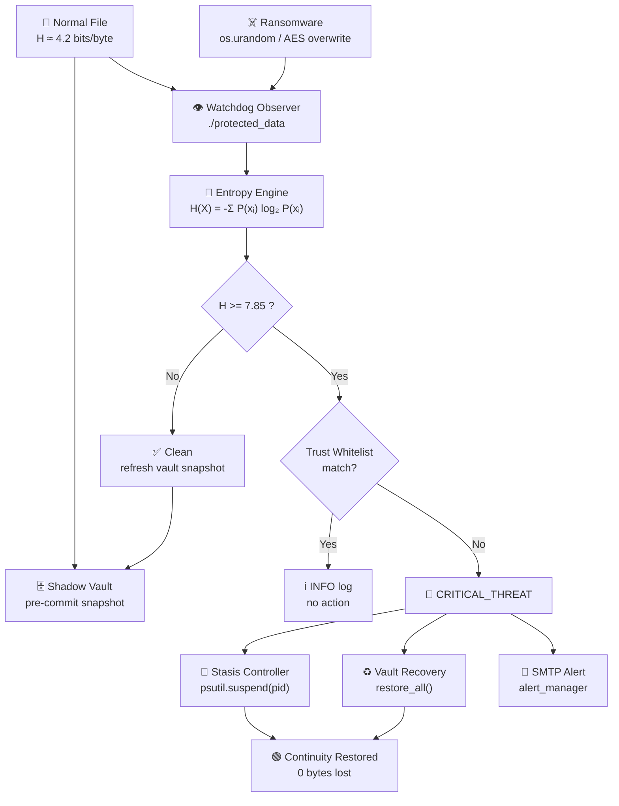
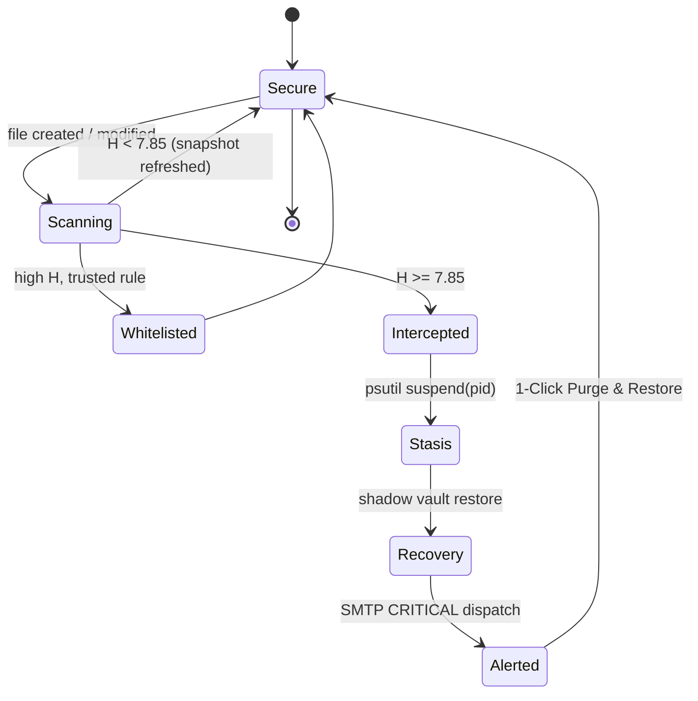

<div align="center">

```text
    ░░░░░░░░░░░░░░░░░░░░░░░░░░░░░░░░░░░░░░░░░░░░░░░
    ░░                                           ░░
    ░░  █████╗ ███████╗ ██████╗ ██╗███████╗     ░░
    ░░ ██╔══██╗██╔════╝██╔════╝ ██║██╔════╝     ░░
    ░░ ███████║█████╗  ██║  ███╗██║███████╗     ░░
    ░░ ██╔══██║██╔══╝  ██║   ██║██║╚════██║     ░░
    ░░ ██║  ██║███████╗╚██████╔╝██║███████║      ░░
    ░░ ╚═╝  ╚═╝╚══════╝ ╚═════╝ ╚═╝╚══════╝      ░░
    ░░                                           ░░
    ░░   AUTONOMOUS RANSOMWARE INTERCEPTION      ░░
    ░░   & BUSINESS CONTINUITY ENGINE             ░░
    ░░                                           ░░
    ░░░░░░░░░░░░░░░░░░░░░░░░░░░░░░░░░░░░░░░░░░░░░░░
```


**Not a smoke detector. A fire suppression system.**

Aegis is a **Business Continuity Engine** — it doesn't just tell you that ransomware is running,
it freezes the attacking process mid-write and restores your last clean bytes automatically.

Built in-house by **Team Aegis**.

</div>

---

## 🚀 Mission

Traditional endpoint security relies on **signatures** (what the malware *is*) or **ML heuristics**
(what the malware *looks like*). Both fail against zero-day ransomware strains.

Aegis ignores identity entirely and watches **physics**. Encryption has an unavoidable, deterministic
side effect: it drives file data toward perfect randomness. That is measurable in real time, in
milliseconds, with zero training data.

| Traditional AV | Project Aegis |
| --- | --- |
| Detects known strains | Detects the *act* of encryption |
| Alerts after damage | Freezes the process mid-write |
| Restore from nightly backup | Restores from pre-commit shadow vault |
| Hours of downtime | Seconds of downtime |

---

## 🧠 The Math (Shannon Entropy)

Every file is a byte stream. Aegis measures its **Shannon Entropy**:

$$H(X) = -\sum_{i=0}^{255} P(x_i)\,\log_2 P(x_i)$$

Where `P(xᵢ)` is the observed frequency of byte value `i`. The result is measured in **bits per byte**,
bounded to `[0, 8]`.

| Content type | Typical H |
| --- | --- |
| English text / source code | 3.5 – 5.0 |
| Office documents, PDFs | 5.0 – 7.0 |
| Compressed archives (zip, jpg, mp4) | 7.5 – 7.9 |
| **AES / RSA encrypted payload** | **7.95 – 8.00** |

**Interception threshold: `H >= 7.85`.**

Compressed formats that legitimately live near the ceiling are excluded via the **Trust Whitelist**,
so the threshold stays aggressive without generating false positives.

---

## 🏗 Architecture



### Interception state machine



---

## 📁 Project Structure

```text
Project_Aegis/
├── core/
│   ├── entropy_engine.py      # Watchdog handler + Shannon entropy math
│   ├── stasis_controller.py   # Process freezing (tarpit) via psutil
│   ├── vault_manager.py       # Pre-commit .shadow_vault snapshots
│   ├── whitelist_manager.py   # Trust rules: folder / file / ext / glob
│   └── alert_manager.py       # SMTP CRITICAL alerting
├── frontend/
│   ├── app.py                 # Main console (live monitoring)
│   ├── theme.py               # Shared brutalist theme
│   └── pages/
│       ├── 1_Whitelist.py     # Trust rule editor
│       └── 2_Live_Demo.py     # Continuity demo harness
├── attack_simulator.py        # Safe ransomware simulation (10 files)
├── main.py                    # Headless CLI entry point
└── requirements.txt
```

---

## 🖥️ Visuals

> Drop your screenshots into `docs/` — the placeholders below pick them up automatically.

| Secure state | Threat intercepted |
| --- | --- |
|  |  |

**Live entropy matrix**


**Trust whitelist editor**


**Continuity demo run**


---

## ✨ Features Overview

- 🧮 **Deterministic Entropy Engine** — O(n) byte-histogram Shannon entropy, no ML, no signatures, no training.
- 🧊 **Thread Stasis (Tarpit)** — suspends the offending PID instead of killing it, preserving forensic state.
- 🗄️ **Pre-Commit Shadow Vault** — rolling snapshots of every file while it is still clean, with a JSON manifest and atomic swaps.
- 🛡️ **Trust Whitelist Engine** — folder, file, extension and glob rules; hot-reloaded, editable from the dashboard.
- 📧 **SMTP CRITICAL Alerts** — asynchronous email dispatch with STARTTLS toggle for local relays.
- 🖥️ **Brutalist Ops Console** — true-black Streamlit dashboard, live colorized log feed, 1-Click Purge & Restore.
- 🧪 **Safe Attack Simulator** — reproducible `os.urandom(2048)` overwrite demo, sandboxed to `./protected_data`.

---

## ⚙️ Installation

**Requirements:** Python 3.11+

```bash
git clone <your-repo-url>
cd Project_Aegis

python -m venv .venv
source .venv/bin/activate        # Windows: .venv\Scripts\activate

pip install -r requirements.txt
```

### Configure alerting

```bash
cp .env.example .env
```

```dotenv
SMTP_HOST=smtp.gmail.com
SMTP_PORT=587
SMTP_USER=you@example.com
SMTP_PASSWORD=your_app_password
SMTP_STARTTLS=true
ALERT_FROM=aegis@yourcompany.com
ALERT_TO=security@yourcompany.com

AEGIS_WATCH_DIR=./protected_data
AEGIS_ENTROPY_THRESHOLD=7.85
```

| Provider | Host | Port | STARTTLS |
| --- | --- | --- | --- |
| Gmail (App Password) | `smtp.gmail.com` | 587 | true |
| Outlook / M365 | `smtp.office365.com` | 587 | true |
| SendGrid | `smtp.sendgrid.net` | 587 | true |
| Local sink (MailHog) | `localhost` | 1025 | false |

> Gmail requires a **16-character App Password** (Google Account → Security → 2-Step Verification → App passwords).
> Your normal account password will be rejected.

---

## 🛡️ The Demo

**1. Launch the console**

```bash
streamlit run frontend/app.py
```

The watchdog observer starts in-process against `./protected_data`. Status: 🟢 **System Secure**.

**2. Fire the attack**

Either press **RUN ATTACK SIMULATION** on the *Live Demo* page, or run it manually in a second terminal:

```bash
python attack_simulator.py
```

It writes 10 realistic plaintext business documents (`H ≈ 4.3`), waits 5 seconds, then overwrites
them with `os.urandom(2048)` (`H ≈ 7.95`).

**3. Watch the interception**

Within milliseconds the console flips to 🔴 **THREAT INTERCEPTED & FROZEN**:

```text
[WATCH]    invoice_q3.txt        H=4.31  CLEAN     → vault snapshot
[CRITICAL] invoice_q3.txt        H=7.96  THRESHOLD BREACH
[STASIS]   pid=48213 suspended   (tarpit engaged)
[VAULT]    invoice_q3.txt        restored from .shadow_vault
[ALERT]    CRITICAL email dispatched → security@yourcompany.com
```

**4. Restore continuity**

Hit **1-Click Purge & Restore**. Every file returns to its last clean state, the vault is re-armed
and the status resets to 🟢 **System Secure**.

**Headless mode** (no UI):

```bash
python main.py
```

---

<div align="center">

**Team Aegis** · Deterministic defense. Zero downtime.

</div>
