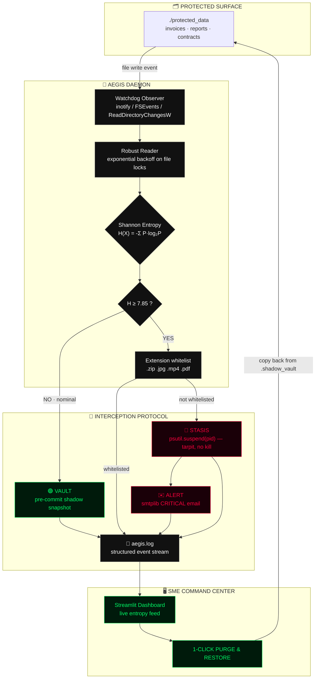

<div align="center">

# 🛡️ PROJECT AEGIS

### Autonomous Early Ransomware Interception & Stasis System

**Ransomware cannot hide from mathematics.**
Aegis ignores signatures and machine learning entirely. It watches the *physics* of your files — and the instant a byte stream becomes statistically indistinguishable from random noise, the attack is frozen mid-write.

[](https://www.python.org/)
[](https://pythonhosted.org/watchdog/)
[](https://psutil.readthedocs.io/)
[](https://numpy.org/)
[](https://streamlit.io/)
[](#-license)

`DETERMINISTIC` · `ZERO TRAINING DATA` · `SUB-SECOND RESPONSE` · `BUILT FOR SMEs`

</div>

---

## ⚡ Why Aegis Exists

Small and medium enterprises are the softest ransomware target on earth: no SOC, no threat-intel subscription, no EDR budget. Signature engines fail against a payload compiled ten minutes ago. ML engines need training data nobody has, and they hallucinate.

Aegis takes the opposite bet. It does not care **what** the malware is, who wrote it, or how it got in. It only asks one question, hundreds of times per second:

> *Did this file just become random?*

Because there is exactly one thing every ransomware family on the planet must do to be profitable — **write encrypted bytes to disk**. That act is mathematically loud, and it cannot be obfuscated.

---

## 🧮 The Core Concept — Shannon Entropy

Entropy measures **unpredictability per byte**, on a scale of 0.0 → 8.0 bits.

<div align="center">

**H(X) = −Σ P(xᵢ) · log₂ P(xᵢ)**

</div>

Think of it as: *"if I show you every byte but one, how hard is it to guess the last?"*

| Content type | Typical entropy | Why |
| :--- | :---: | :--- |
| English prose, invoices, CSV | `4.0 – 5.0` | The letter `e` and the space character dominate. Highly predictable. |
| Source code, JSON, logs | `4.5 – 5.5` | Repeated keywords, indentation, punctuation. |
| Already-compressed (`.zip`, `.jpg`) | `7.2 – 7.8` | Compression removes redundancy — legitimately noisy. |
| **AES-256 / ChaCha20 output** | **`7.95 – 8.00`** | **Perfect ciphertext is indistinguishable from a fair coin flip per bit.** |

Aegis draws the line at **`7.85 bits/byte`** — high enough to sail past compressed media, low enough that no ciphertext can duck under it.

```python
# core/entropy_engine.py — O(n), vectorised, safe to run inside an FS callback
buffer      = np.frombuffer(data, dtype=np.uint8)
counts      = np.bincount(buffer, minlength=256).astype(np.float64)
probability = counts[counts > 0] / counts.sum()
entropy     = float(-np.sum(probability * np.log2(probability)))
```

**Real measured output from the bundled demo:**

```
[20:18:31] [SCAN]            CREATED invoice_00.txt | H=4.6274 bits/byte | NOMINAL
[20:18:31] [VAULT]           Clean baseline snapshot: invoice_00.txt
[20:18:36] [CRITICAL_THREAT] ENCRYPTION SIGNATURE DETECTED on invoice_00.txt | H=7.9040 >= 7.85
[20:18:36] [STASIS]          PID 41277 SUSPENDED. Attack chain halted.
[20:18:36] [ALERT]           Alert delivered to soc-oncall@example.com
```

---

## 🏗️ Architecture



### The Rolling Pre-Commit Vault

The subtle trick: Aegis does **not** wait for an attack to start backing things up. Every time it sees a file in a *clean, low-entropy* state, it takes a shadow snapshot. So when the encryption wave finally lands, the pristine version is already sitting in `.shadow_vault` — restoration is a deterministic copy-back. **No decryption. No key negotiation. No ransom.**

---

## 📁 Project Structure

```
Project_Aegis/
├── core/
│   ├── __init__.py
│   ├── entropy_engine.py      # Shannon math + watchdog handler + threat orchestration
│   ├── stasis_controller.py   # psutil process suspension (tarpit)
│   ├── vault_manager.py       # .shadow_vault snapshots, manifest, restore_all()
│   └── alert_manager.py       # smtplib CRITICAL email dispatch (non-blocking)
├── frontend/
│   ├── app.py                 # Streamlit command center (runs the real observer)
│   ├── theme.py               # shared brutalist CSS + log colouriser
│   └── pages/
│       ├── 1_Whitelist.py     # trusted files / folders / extensions editor
│       └── 2_Live_Demo.py     # one-click attack demo (entropy · stasis · vault)
├── core/whitelist_manager.py  # persistent trust rules (aegis_whitelist.json)
├── simulator/
│   └── ransomware_sim.py      # minimal legacy simulator
├── attack_simulator.py        # ⚔️ the full 10-file live demo attack
├── main.py                    # headless CLI watcher entry point
├── requirements.txt
├── .env.example               # SMTP + monitoring config template
├── aegis_whitelist.json       # trust rules (auto-created, editable in the UI)
└── protected_data/            # 🎯 the monitored directory (auto-created)
```

---

## 🚀 Installation

```bash
git clone https://github.com/vignesh06-OG/Project-Aegis.git
cd Project-Aegis/Project_Aegis

python -m venv .venv
source .venv/bin/activate          # Windows: .venv\Scripts\activate

pip install -r requirements.txt
```

### Configure email alerts (optional but impressive)

```bash
cp .env.example .env
```

Then edit `.env`:

```ini
SMTP_HOST=smtp.gmail.com
SMTP_PORT=587
SMTP_USER=aegis.sentinel@example.com
SMTP_PASS=abcd efgh ijkl mnop        # Gmail App Password, NOT your login password
ALERT_RECIPIENT=soc-oncall@example.com
AEGIS_ALERTS_ENABLED=1
```

> **Gmail:** enable 2-Factor Auth → Google Account → Security → *App passwords* → generate a 16-character password. Never commit `.env`.
> **Streamlit alternative:** put the same keys in `.streamlit/secrets.toml` and Aegis reads them from `st.secrets`.
> Offline demo? Set `AEGIS_ALERTS_ENABLED=0` and everything else still works.

---

## 🎬 The 60-Second Demo

Open **two terminals**.

**Terminal 1 — launch the command center:**

```bash
streamlit run frontend/app.py
```

In the sidebar, press **START**. The header flips to `OBSERVER RUNNING` and the status block glows `🟢 SYSTEM SECURE`.

*(Prefer headless? `python main.py --path ./protected_data` streams the same feed to stdout and `aegis.log`.)*

**Terminal 2 — launch the attack:**

```bash
python attack_simulator.py
```

### What you will watch happen

| T | Event |
| :--- | :--- |
| `T+0s` | 10 realistic business documents are written to `./protected_data`. Feed shows `H≈4.6 · NOMINAL` and each file is silently baselined into the shadow vault. |
| `T+5s` | The simulator turns hostile and starts overwriting files with `os.urandom(2048)`. |
| `T+5.1s` | 🔴 `CRITICAL_THREAT · H=7.9040 >= 7.85`. The status block flips to **THREAT INTERCEPTED & FROZEN** and flashes neon red. |
| `T+5.1s` | `psutil.Process(pid).suspend()` freezes the attacking process **mid-wave** — a tarpit, not a kill, so forensics survive. |
| `T+5.2s` | The `CRITICAL: RANSOMWARE INTERCEPTED` email lands in the operator's inbox. |
| `T+10s` | Hit **⟲ 1-CLICK PURGE & RESTORE**. Every document is rolled back byte-for-byte from `.shadow_vault` and the console returns to `🟢 SYSTEM SECURE`. |

**Verified end-to-end:** `10/10 files restored, 0 failed.`

---

## 🎛️ CLI Reference

```bash
python main.py --path ./protected_data          # start the headless watcher
python main.py --threshold 7.90                 # tighten the trigger
python main.py --no-freeze                      # detect + vault, never suspend
python main.py --presecure                      # snapshot everything before watching

python attack_simulator.py                      # the standard 10-file demo
python attack_simulator.py --count 25 --delay 3 --payload 4096
```

| Env var | Default | Purpose |
| :--- | :--- | :--- |
| `AEGIS_WATCH_PATH` | `./protected_data` | Directory under protection |
| `AEGIS_THRESHOLD` | `7.85` | Entropy trigger, bits/byte |
| `AEGIS_ALERTS_ENABLED` | `1` | Set `0` to mute all outbound email |

---

## 🛡️ Engineering Notes

- **File-lock resilience** — reads retry with exponential backoff (`50ms → 400ms`); ransomware holds exclusive handles during rapid rewrites and a naive reader would simply crash.
- **Debouncing** — the OS fires multiple `on_modified` events per logical write; a 350 ms per-path window keeps the feed and the CPU clean.
- **Sampling** — only the first 64 KB is scored. Uniform-random entropy converges almost immediately, so the watcher stays real-time on multi-GB files.
- **Statistical floor** — files under 256 bytes are ignored; tiny samples look "random" by pure accident.
- **False-positive control** — `.zip .jpg .mp4 .pdf .docx` and friends are whitelisted; they are legitimately noisy.
- **Non-blocking alerts** — SMTP runs on a daemon thread. A mail outage can never stall an interception.
- **Stasis, not termination** — `suspend()` preserves the process, its memory, and often the encryption key in RAM, which is exactly what an incident responder wants.
- **Self-exclusion** — the vault and `aegis.log` are excluded from monitoring; otherwise the watcher would trigger on itself forever.

---

## ⚠️ Scope & Safety

`attack_simulator.py` performs **no real encryption**. It writes `os.urandom` bytes into files it created itself inside `./protected_data`, and never touches anything outside that directory.

Aegis is a hackathon-grade prototype demonstrating a detection principle — it is not a replacement for offline backups, patching, or endpoint hardening.

---

## 🗺️ Roadmap

- [ ] Kernel-level `eBPF` hooks to block the write syscall *before* it commits
- [ ] Chi-square + serial-correlation tests alongside entropy for a composite score
- [ ] Copy-on-write vault snapshots (`btrfs` / ZFS) for zero-cost baselining
- [ ] Multi-endpoint fleet console with a central threat timeline
- [ ] Signed, immutable audit log for compliance reporting

---

<div align="center">

**Project Aegis** — *deterministic defence. no ML. no signatures. no ransom.*

Built for SMEs that cannot afford a SOC, and cannot afford to be down.

</div>
